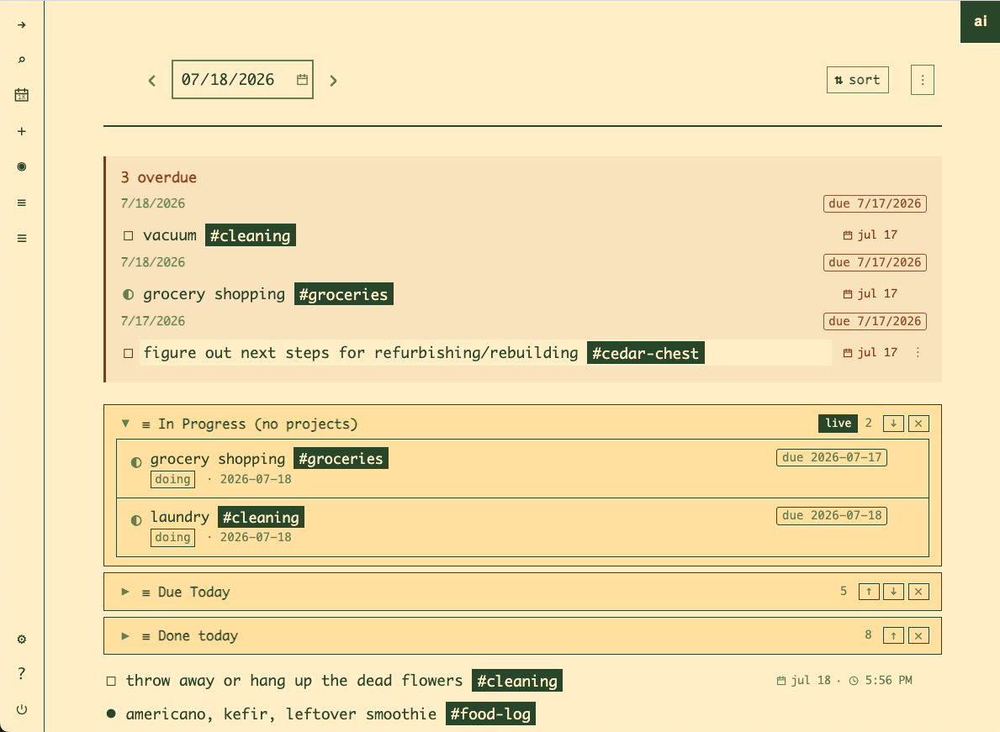

# Brainspread

A note-taking app I built for myself. The two big influences are Logseq
(every day gets its own page, and that's where you write) and zettelkasten
(tags do the organizing). It also has an MCP server, so Claude Code can read
and write your notes.



## Why

I want a notes app that gives me:

- as little friction as possible when writing something down and keeping it
  organized
- powerful sorting and filtering of tags
- something that keeps me on track, and can nudge me if I ask it to
- a way to loop forgotten things back into my life instead of letting them
  rot below the fold
- a way to automate the stuff I do repeatedly, like:
  - copy my workout to the daily page on Tuesday and Thursday
  - estimate calories and macros whenever a new block tagged `#food-log` is
    created
  - write up new recipes and generate this week's grocery list from past
    grocery lists and whatever I'm planning to cook
  - sweep everything tagged `#recipe` onto the recipes page once a week

## Capture and tags

The app opens to today's daily page, which already exists and is where most
writing happens. You can go to any page and create blocks there directly;
the daily is just the default landing spot when you don't want to think
about where something goes. Organization comes from tags, and a tag is a
page (and a page is a tag). Typing `#strength-training` in a block makes that block a
member of the strength-training page. Open the page and every block you've
ever tagged with it is sitting there. A block can belong to as many pages as
you tag it with.

Blocks can also be moved onto a page for real, one-off or in bulk. A
pattern I use constantly: write a pile of notes nested under a single block
on the daily, tag that block with the page I want them to end up on, and
move the whole thing over later. The goal is for an automation to do that
sorting for you: everything matching some tag or `key:: value` gets swept
onto its page on a schedule.

There's also `[[wiki link]]` syntax that gives you backlinks between pages.
Honestly I never use it. Tags cover it for me.

## Where it's headed

The next big piece is automations
([#143](https://github.com/steezeburger/brainspread/issues/143)): blocks
tagged `#automation` whose `trigger:: / query:: / action::` properties make
them do things. The automation examples in the Why section are all this
feature. A few more:

- roll sticky todos onto today every morning
- ping Discord every 15 minutes while a block is marked `doing`
  ("still on this?")
- apply the morning routine template on a schedule

This is also the plan for looping forgotten things back in: an automation
(or Claude Code over MCP) queries for stale stuff and resurfaces it, so it
doesn't depend on me remembering to go look. Automations live in the graph
as ordinary blocks, which means a template containing one becomes a
shareable automation pack. A declarative widget layer (habit heatmaps,
streaks, countdowns) is sketched in
[#168](https://github.com/steezeburger/brainspread/issues/168). Parts of the
engine are built and it's landing in slices.

## The pieces

### Blocks, todos, and days

Everything is a block in a nested outline. Blocks can be bullets, todos
(`todo` / `doing` / `done`, plus `later` and `wontdo`), headings, quotes,
code, images, files. Every day gets its own page automatically, and past
dailies stay browsable, so the app doubles as a journal.

### Scheduling, rollover, and reminders

Scheduling a block gives it a due date without moving it. It stays where you
wrote it and surfaces on the daily page for that date. Anything that slips
shows up in the built-in Overdue view, and undone todos can be rolled
forward onto today.

Reminders are the louder version. Attach a time to a block and a scheduler
posts it to Discord with a mention, so it hits your phone. The message
carries action links (mark done, mark doing, move to today, snooze
15m/30m/1h/1d), so you can handle it from the notification without opening
the app.

### Saved views

Saved views are queries over your blocks: filter by block type, tags, due or
completed dates, `key:: value` properties, or content, combined with
and/or/not. Pin a view to the sidebar, or embed it on a page so its results
render inline. An embed can also be pinned to the daily page as a concept,
so a "due today" embed follows you from day to day. Two ship out of the box:
Overdue and Done this week.

Blocks parse `key:: value` lines into queryable properties, so views can
slice on whatever structure you invent (`project:: roadmap`,
`priority:: p1`, etc).

### Templates

A template is a page whose block tree can be stamped onto any other page.
Copies are independent, so checking off a cloned todo doesn't touch the
template. Tags and embedded views come along too, so a morning routine
template can carry both its checklist and an open-todos embed in one apply.

### The MCP server

To be clear, the app doesn't need AI to be worth using. The daily page,
tags, views, and (soon) automations carry it on their own. But it exposes an
MCP server at `/api/mcp/` (streamable HTTP), so Claude Code or any other MCP
client can operate on your notes directly, and that turns out to be a big
multiplier. Every AI note app can summarize your week or answer questions
about your notes. What's different here is that the agent gets the same
primitives the app is built on: due dates, tags that are pages,
`key:: value` properties, saved views, templates, reminders. So the prompts
worth typing look like:

- "reschedule everything overdue, spread it over the next week"
- "sweep the recipe blocks scattered across my dailies onto the recipes
  page"
- "put priority:: p1 on the deploy todos and pin a view of open p1s"
- "apply my packing template to today and set a reminder for 7am to start
  on it"

It gets better when you connect the server to a Claude Code remote session,
because that session is reachable from the Claude mobile/desktop/web apps.
Your notes become something you can talk to from anywhere, including by
voice. Stuff I actually use this for:

- hands-free capture: "hey brainspread, remind me to flip the laundry in 30
  minutes"
- sitting back down and asking "what was I doing?"
- pasting garbage in and getting structure out. I once pasted an HTML table
  as plain text and asked for a block; it made a CSV table because it knew
  brainspread renders those nicely.
- the usual assistant stuff (research, planning a trip, packing lists) works
  too, with the difference that the results land in my notes instead of
  dying in a chat log

And once automations land, creating one by voice is the endgame: "every
Tuesday and Thursday, copy my workout to the daily page" said out loud on a
walk, and it exists.

It's a small surface, 16 tools covering pages, blocks, todos, search,
scheduling, and tagging, each a thin wrapper over the same commands the UI
uses.

Auth is the same token the web app gets when you log in (visible in the
Django admin under Auth Tokens):

```bash
claude mcp add --transport http brainspread http://localhost:8001/api/mcp/ \
  --header "Authorization: Token YOUR_TOKEN"
```

### The in-app chat

There's also a chat panel next to your notes, with persistent history,
bring-your-own-key support for Anthropic/OpenAI/Google, web search, and a
bigger toolset with an approval gate on writes. Good for quick stuff like
"what did I get done this week?" without leaving the app.

### Odds and ends

Whiteboards (tldraw), web archives (save a readable copy of a link, attached
to the block that mentions it), public share links for pages, favorites, a
graph view, file attachments, and search on Cmd+K.

## Quick start

Prerequisites: [Docker](https://docs.docker.com/get-docker/) and
[Just](https://github.com/casey/just).

```bash
cd packages/django-app

just copy-env               # create .env from the template
just generate-secret-key    # paste the output into DJANGO_SECRET_KEY in .env

just create-volumes
just build
just up-d db
just migrate
just reload-db              # loads dev fixtures (admin user)
just up                     # start the app
```

Then open:

- App: http://localhost:8001/
- Admin: http://localhost:8001/admin/
- Login: `admin@email.com` / `password`

For Discord reminders, set your webhook URL and Discord user ID in user
settings and run with `REMINDERS_ENABLED=true`. The scheduler container
checks for due reminders every minute.

See [`.ai/PROJECT_SETUP.md`](.ai/PROJECT_SETUP.md) for the full setup
walkthrough.

## Architecture

Django + PostgreSQL, vanilla JavaScript frontend, Docker Compose. Business
logic lives in commands, data access in repositories. See
[`CLAUDE.md`](CLAUDE.md) for the conventions.

## Development

Common tasks (run from `packages/django-app/`):

- `just up` / `just up-d` - start all services (foreground / detached)
- `just down` - stop all services
- `just migrate` / `just makemigrations` - database migrations
- `just shell` - Django shell
- `just test` - run the test suite
- `just reload-db` - reset the database and reload dev fixtures
- `just tail-logs web 100` - tail the last 100 lines of web logs
- `just prepush` - run the pre-push checks (run this before pushing)
