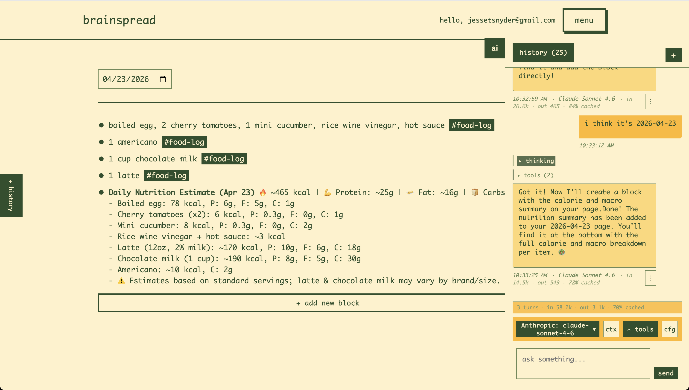

# Brainspread

A web-based knowledge management system with hierarchical note-taking, daily journaling, and AI chat integration.



## Features

### Knowledge Management

- **Hierarchical notes** — create and organize deeply nested blocks of content, so ideas can live at whatever depth they belong.
- **Daily notes** — every day gets its own page automatically, ready for journaling, standups, and task capture.
- **TODO management** — built-in todos with the ability to roll undone items forward to the next day so nothing gets dropped.
- **Pages and blocks** — flexible content model where pages contain nested blocks, giving you outlines, docs, and scratchpads in one place.
- **Historical view** — browse past daily notes to revisit decisions, track progress, and see how thinking evolved over time.

### AI Integration

- **Multi-provider support** — works with OpenAI, Anthropic, and Google AI out of the box.
- **Chat interface** — a built-in chat with persistent conversation history, right next to your notes.
- **Configurable models** — pick the model per provider to match the task (fast vs. smart, cheap vs. capable).
- **Agentic note tools** — the assistant can search, read, create, edit, reorder, and move pages and blocks directly in your knowledge base via tool calls.
- **Web search** — the assistant can pull in fresh information from the web when your notes alone aren't enough.
- **Approval flow for writes** — destructive or create/edit operations pause for your confirmation before they run, with an opt-in to auto-approve note writes when you want to move fast.

### User Experience

- **Modern web interface** — clean, responsive UI built with vanilla JavaScript — no framework tax.
- **Real-time interactions** — dynamic updates without full page refreshes.
- **User authentication** — secure accounts with customizable themes and timezones.
- **Settings management** — configure AI providers, preferences, and personalization from one place.

## Quick Start

Prerequisites: [Docker](https://docs.docker.com/get-docker/) and [Just](https://github.com/casey/just).

```bash
cd packages/django-app

just copy-env               # create .env from the template
just generate-secret-key    # paste the output into DJANGO_SECRET_KEY in .env

just create-volumes
just build
just up-d db
just migrate
just reload-db              # loads dev fixtures (admin user)
just up                     # start the app
```

Then open:

- App: http://localhost:8001/
- Admin: http://localhost:8001/admin/
- Login: `admin@email.com` / `password`

See [`.ai/PROJECT_SETUP.md`](.ai/PROJECT_SETUP.md) for the full setup walkthrough.

## Architecture

- **Backend** — Django with PostgreSQL.
- **Frontend** — vanilla JavaScript with modular components.
- **Deployment** — Docker Compose with separate web and database containers.
- **Patterns** — command pattern for business logic, repository pattern for data access.

## Development

Common tasks (run from `packages/django-app/`):

- `just up` / `just up-d` — start all services (foreground / detached).
- `just down` — stop all services.
- `just migrate` — apply database migrations.
- `just makemigrations` — create new migrations.
- `just shell` — Django shell.
- `just test` — run the test suite.
- `just reload-db` — reset the database and reload dev fixtures.
- `just tail-logs web 100` — tail the last 100 lines of web logs.
- `just prepush` — run the pre-push checks (run this before pushing).

## Further Documentation

- [`CLAUDE.md`](CLAUDE.md) — project conventions and architectural patterns.
- [`.ai/PROJECT_SETUP.md`](.ai/PROJECT_SETUP.md) — detailed setup guide.
