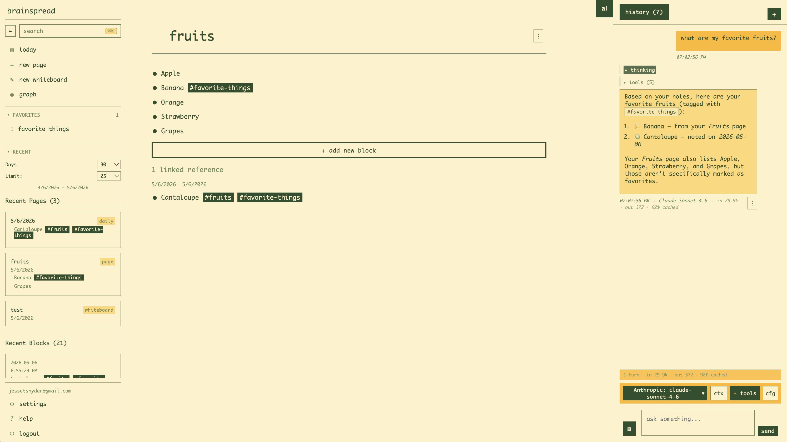

# Brainspread

A networked note-taking app I built for myself. It steals its two best ideas
from elsewhere: from Logseq, the daily page — open the app and start typing,
no folders, no "where should this go"; and from zettelkasten practice, tags
as the organizing principle — tag things as you capture them, sort them into
their proper pages later, if ever. It also speaks MCP, so Claude Code can
work inside your notes.



## Why

Every notes system I've used dies the same way: the friction of deciding
where a note belongs is just high enough that I stop writing notes. So in
Brainspread everything lands in the same place — today's daily page, which
already exists the moment you open the app. You write, you hit enter, you
move on.

Organization happens through tags, and a tag here is just a page. Typing
`#strength-training` in a block makes that block a member of the
strength-training page; open the page and the block is there, alongside
everything else you've tagged over the weeks. When a topic accumulates
enough strays you can select them and move them onto the page for real.
Organizing becomes a batch job you run when you're in the mood, not a tax
you pay on every thought. `[[Wiki links]]` and backlinks tie the rest of the
graph together.

Beyond capture, the app is built around a few things I actually want from a
tool like this:

- as little friction as possible when writing something down
- something that keeps me on track, and can nudge me if I ask it to
- a way to loop forgotten things back into my life instead of letting them
  rot below the fold
- a way to automate the stuff I do repeatedly

## The pieces

### Blocks, todos, and days

Everything is a block in a nested outline. Blocks can be plain bullets,
todos (`todo` → `doing` → `done`, plus `later` and `wontdo`), headings,
quotes, code, images, files. Every day gets its own page automatically, and
past dailies stay browsable, so the app doubles as a journal.

### Scheduling, rollover, and reminders

Scheduling a block gives it a due date without moving it — it stays where
you wrote it and *surfaces* on the daily page for that date. Anything that
slips shows up in the built-in Overdue view, and undone todos can be rolled
forward onto today so nothing silently disappears into last Tuesday.

Reminders are the louder version: attach a time to a block and a scheduler
delivers it to Discord, with a mention so it hits your phone. The message
carries action links — mark done, mark doing, move to today, snooze for
15m/30m/1h/1d — so you can deal with a reminder from the notification
without opening the app. This is the "loop things back into my life" part,
and it's the feature I'd keep if I had to throw out everything else.

### Saved views

Saved views are queries over your blocks: filter by block type, tags, due or
completed dates, `key:: value` properties, or content, combined with
and/or/not. Pin a view to the sidebar, or embed it directly on a page so its
results render inline. Embeds can also be pinned to "the daily page" as a
concept, so a *what's due today* embed follows you from day to day. Two
views ship out of the box: Overdue and Done this week.

Blocks parse `key:: value` lines into queryable properties, so views can
slice on whatever structure you invent — `project:: roadmap`,
`priority:: p1`, whatever.

### Templates

A template is a page whose block tree can be stamped onto any other page.
Copies are independent (checking off a cloned todo doesn't touch the
template), tags come along, and embedded views come along too — so a
"morning routine" template can carry both its checklist and an open-todos
embed in one apply.

### The MCP server

Brainspread exposes an MCP server at `/api/mcp/` (streamable HTTP), which
means Claude Code — or any MCP client — can operate on your notes directly.
This has turned out to be the integration that matters. The in-app chat is
convenient, but pointing an actual agent at your knowledge base is a
different thing entirely:

- "what's on my plate today?"
- "reschedule everything overdue to spread over the next week"
- "read my dailies from last week and write a review on today's page"
- "find my untagged workout notes and tag them #strength-training"

It exposes a deliberately small surface — 16 tools covering pages, blocks,
todos, search, scheduling, and tagging — each one a thin wrapper over the
same commands the UI uses.

Auth is the same token the web app gets when you log in (visible in the
Django admin under Auth Tokens):

```bash
claude mcp add --transport http brainspread http://localhost:8001/api/mcp/ \
  --header "Authorization: Token YOUR_TOKEN"
```

### The in-app chat

There's also a chat panel next to your notes, with persistent history,
bring-your-own-key support for Anthropic/OpenAI/Google, web search, and a
larger agentic toolset with an approval gate on writes. It's useful, but
it's not the point — every app has a chat panel now. The MCP server is the
interesting half of the AI story.

### Odds and ends

Whiteboards (tldraw), web archives (save a readable copy of a link, attached
to the block that mentions it), public share links for pages, favorites,
a graph view, file attachments, completion stats and streaks, and a
spotlight-style search on Cmd+Space.

## Where it's headed

The next big piece is automations
([#143](https://github.com/steezeburger/brainspread/issues/143)): blocks
tagged `#automation` whose `trigger:: / query:: / action::` properties make
them *do* things — roll sticky todos onto today every morning, ping Discord
every 15 minutes while a block is marked `doing` ("still on this?"), apply
the morning-routine template on a schedule. Because automations live in the
graph as ordinary blocks, a template containing one becomes a shareable
automation pack. A declarative widget layer (habit heatmaps, streaks,
countdowns) is sketched in
[#168](https://github.com/steezeburger/brainspread/issues/168). Parts of the
automation engine are built; it's landing in slices.

## Quick start

Prerequisites: [Docker](https://docs.docker.com/get-docker/) and
[Just](https://github.com/casey/just).

```bash
cd packages/django-app

just copy-env               # create .env from the template
just generate-secret-key    # paste the output into DJANGO_SECRET_KEY in .env

just create-volumes
just build
just up-d db
just migrate
just reload-db              # loads dev fixtures (admin user)
just up                     # start the app
```

Then open:

- App: http://localhost:8001/
- Admin: http://localhost:8001/admin/
- Login: `admin@email.com` / `password`

For Discord reminders, set your webhook URL and Discord user ID in user
settings and run with `REMINDERS_ENABLED=true` — the scheduler container
checks for due reminders every minute.

See [`.ai/PROJECT_SETUP.md`](.ai/PROJECT_SETUP.md) for the full setup
walkthrough.

## Architecture

Django + PostgreSQL, vanilla JavaScript frontend, Docker Compose. Business
logic lives in commands, data access in repositories — see
[`CLAUDE.md`](CLAUDE.md) for the conventions.

## Development

Common tasks (run from `packages/django-app/`):

- `just up` / `just up-d` — start all services (foreground / detached)
- `just down` — stop all services
- `just migrate` / `just makemigrations` — database migrations
- `just shell` — Django shell
- `just test` — run the test suite
- `just reload-db` — reset the database and reload dev fixtures
- `just tail-logs web 100` — tail the last 100 lines of web logs
- `just prepush` — run the pre-push checks (run this before pushing)
