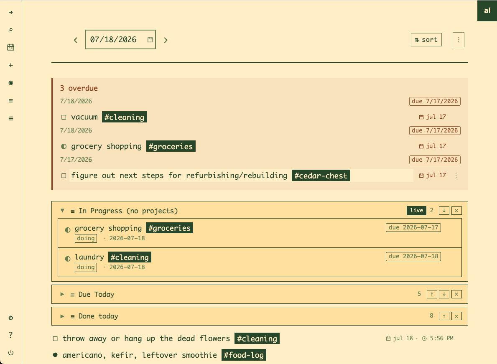

# Brainspread

A note-taking app I built for myself. The two big influences are Logseq
(every day gets its own page, and that's where you write) and zettelkasten
(tags do the organizing). It also has an MCP server, so Claude Code can read
and write your notes.



## Why

I want a notes app that gives me:

- as little friction as possible when writing something down and keeping it
  organized
- powerful sorting and filtering of tags
- something that keeps me on track, and can nudge me if I ask it to
- a way to loop forgotten things back into my life instead of letting them
  rot below the fold
- a way to automate the stuff I do repeatedly, like:
  - copy my workout to the daily page on Tuesday and Thursday
  - estimate calories and macros whenever a new block tagged `#food-log` is
    created
  - write up new recipes and generate this week's grocery list from past
    grocery lists and whatever I'm planning to cook
  - sweep everything tagged `#recipe` onto the recipes page once a week

## Capture and tags

The app opens to today's daily page, which already exists and is where most
writing happens. You can go to any page and create blocks there directly;
the daily is just the default landing spot when you don't want to think
about where something goes. Organization comes from tags, and a tag is a
page (and a page is a tag). Typing `#strength-training` in a block makes that block a
member of the strength-training page. Open the page and every block you've
ever tagged with it is sitting there. A block can belong to as many pages as
you tag it with.

Blocks can also be moved onto a page for real, one-off or in bulk. A
pattern I use constantly: write a pile of notes nested under a single block
on the daily, tag that block with the page I want them to end up on, and
move the whole thing over later. Automations (below) do this sorting for
you automatically.

There's also `[[wiki link]]` syntax that gives you backlinks between pages.
Honestly I never use it. Tags cover it for me.

## Automations

This is the feature I actually live in. An automation is just a block
tagged `#automation`, with properties describing when it fires and what it
does:

```
- #automation Copy workout to today on lift days
trigger:: schedule weekly tue,thu 5:30
action:: apply_template "strength training" to today
enabled:: true
```

**Triggers** run on a schedule — `every N minutes`, `hourly`, `daily HH:MM`,
`weekly <days> HH:MM`, or a raw `cron` expression for anything cron can
express — or you fire one manually from the ⋮ menu, chat, or MCP.

**Queries** are the same filter language as saved views (below): tags,
block type, due/completed dates, `key:: value` properties, combined with
and/or/not. An automation with a `query::` runs its action over every
matching block:

```
- #automation Nudge stale open todos
trigger:: daily 9:00
query:: type:todo and tag:priority and due < today
action:: notify "{{count}} p1 todos are overdue" on match
enabled:: true
```

**Actions** are one of the built-in verbs — `move_to_daily`, `move_to_page`,
`set_type`, `tag`, `untag`, `set_due`, `set_property`, `create_block`,
`notify`, `apply_template` — each a thin wrapper over the same commands the
UI and MCP tools call, so an automation can't do anything you couldn't do by
hand. `allow::` explicitly grants which verbs an automation may run, so a
query-driven automation can't quietly escalate into something it wasn't
written to do.

Two more pieces that make automations compose instead of staying one-shot:

- **`for::`** iterates an action over a literal list or numeric range
  instead of a query — `for:: 1..5` or `for:: 10,20,30` — binding
  `{{item}}` per step. Good for generating a run of blocks (a week's worth
  of habit-tracker rows, a countdown) without a query behind it.
- **Variables** (next section) let an action's text pull in live values —
  the match count, today's date, a block's own tag or due date — instead of
  being static.

Because an automation lives in the graph as an ordinary block, a template
that contains one becomes a shareable automation pack: apply the template,
get the automation too.

## Reminders

Reminders are automations' louder cousin: attach a time to a block and the
scheduler posts it to Discord with a mention, so it actually reaches your
phone instead of waiting for you to open the app. The message carries
action buttons — mark done, mark doing, move to today, snooze 15m / 30m /
1h / 1d — so you can handle it from the notification itself.

Scheduling a block (giving it a due date without a Discord ping) is the
quieter version: it stays where you wrote it and surfaces on the daily page
for that date, and anything that slips shows up in the built-in Overdue
view. Undone todos can be rolled forward onto today in bulk.

## Variables

Block content can carry `{{token}}` placeholders that resolve once, at the
moment you save the block or apply a template — snapshots, not live
formulas, so a resolved value never silently changes later.

Built-ins cover the obvious stuff — `{{today}}`, `{{now}}`,
`{{current_time}}`, `{{uuid}}` — plus a few that are more interesting than
they look:

- `{{count:<query>}}` freezes a count at write time. Put
  `Open going into the week: {{count:type:todo and completed is null}}` in
  a weekly review template, and every week's apply records that week's
  number forever — a time series made of ordinary template applies.
- `{{input:<label>}}` prompts for a value when a template is applied.
- Filters chain Jinja-style: `{{now|time}}`, `{{today|format:%A}}`.
- Inside automation actions, a per-block family resolves per match —
  `{{block.tag}}`, `{{block.content}}`, `{{block.due}}` — plus `{{count}}`
  for the automation's total match count and `{{item}}` for `for::`
  iteration.

On top of the built-ins, you can define your own: a custom variable is a
name that expands to whatever text you stored for it, usable anywhere a
built-in token is, and it can itself contain built-ins
(`{{current_time}} #food-log`) or other custom variables, nested and
resolved before substitution.

## The pieces

### Blocks, todos, and days

Everything is a block in a nested outline. Blocks can be bullets, todos
(`todo` / `doing` / `done`, plus `later` and `wontdo`), headings, quotes,
code, images, files. Every day gets its own page automatically, and past
dailies stay browsable, so the app doubles as a journal. Every edit is
kept as append-only history, so a block you cleared by accident is a
restore away, not gone.

### Saved views

Saved views are queries over your blocks: filter by block type, tags, due or
completed dates, `key:: value` properties, or content, combined with
and/or/not — the same language automations use. Pin a view to the sidebar,
or embed it on a page so its results render inline. An embed can also be
pinned to the daily page as a concept, so a "due today" embed follows you
from day to day. Two ship out of the box: Overdue and Done this week.

Blocks parse `key:: value` lines into queryable properties, so views can
slice on whatever structure you invent (`project:: roadmap`,
`priority:: p1`, etc).

### Templates

A template is a page whose block tree can be stamped onto any other page.
Copies are independent, so checking off a cloned todo doesn't touch the
template. Tags, embedded views, and automations all come along too, so a
morning routine template can carry its checklist, an open-todos embed, and
the automation that applies it — in one apply.

### The MCP server

To be clear, the app doesn't need AI to be worth using. The daily page,
tags, automations, and views carry it on their own. But it exposes an MCP
server at `/api/mcp/` (streamable HTTP), so Claude Code or any other MCP
client can operate on your notes directly, and that turns out to be a big
multiplier. Every AI note app can summarize your week or answer questions
about your notes. What's different here is that the agent gets the same
primitives the app is built on: due dates, tags that are pages,
`key:: value` properties, saved views, templates, automations, reminders.
So the prompts worth typing look like:

- "reschedule everything overdue, spread it over the next week"
- "sweep the recipe blocks scattered across my dailies onto the recipes
  page"
- "put priority:: p1 on the deploy todos and pin a view of open p1s"
- "every Tuesday and Thursday, copy my workout to the daily page" —
  said out loud, and the automation exists

It's a small surface, 16 tools covering pages, blocks, todos, search,
scheduling, tagging, and automations, each a thin wrapper over the same
commands the UI uses.

Auth is the same token the web app gets when you log in (visible in the
Django admin under Auth Tokens):

```bash
claude mcp add --transport http brainspread http://localhost:8001/api/mcp/ \
  --header "Authorization: Token YOUR_TOKEN"
```

It gets better when you connect the server to a Claude Code remote session,
because that session is reachable from the Claude mobile/desktop/web apps.
Your notes become something you can talk to from anywhere, including by
voice. Stuff I actually use this for:

- hands-free capture: "hey brainspread, remind me to flip the laundry in 30
  minutes"
- sitting back down and asking "what was I doing?"
- pasting garbage in and getting structure out. I once pasted an HTML table
  as plain text and asked for a block; it made a CSV table because it knew
  brainspread renders those nicely.
- the usual assistant stuff (research, planning a trip, packing lists) works
  too, with the difference that the results land in my notes instead of
  dying in a chat log

### The in-app chat

There's also a chat panel next to your notes, with persistent history,
bring-your-own-key support for Anthropic/OpenAI/Google, web search, and a
bigger toolset with an approval gate on writes. Good for quick stuff like
"what did I get done this week?" without leaving the app.

### Odds and ends

Whiteboards (tldraw), web archives (save a readable copy of a link, attached
to the block that mentions it), a Trash you can restore from, public share
links for pages, favorites, a graph view, file attachments, and search on
Cmd+K.

## Where it's headed

Automations currently answer "what matches right now" on every tick. The
next slice adds state-change semantics: `when:: becomes-empty` /
`becomes-nonempty` / `count > N` so an automation fires on a transition
instead of every tick, plus `matched-for` dwell tracking ("nudge a `doing`
block open for 2h"). After that: chaining verbs in one run
(`action:: A then B`), a `prompt` action that runs the agent loop headless
against matched blocks, inbound webhooks and an `http` action, and a
declarative widget layer (habit heatmaps, streaks, countdowns) sketched in
[#168](https://github.com/steezeburger/brainspread/issues/168).

## Quick start

Prerequisites: [Docker](https://docs.docker.com/get-docker/) and
[Just](https://github.com/casey/just).

```bash
cd packages/django-app

just copy-env               # create .env from the template
just generate-secret-key    # paste the output into DJANGO_SECRET_KEY in .env

just create-volumes
just build
just up-d db
just migrate
just reload-db              # loads dev fixtures (admin user)
just up                     # start the app
```

Then open:

- App: http://localhost:8001/
- Admin: http://localhost:8001/admin/
- Login: `admin@email.com` / `password`

For Discord reminders, set your webhook URL and Discord user ID in user
settings and run with `REMINDERS_ENABLED=true`. The scheduler container
checks for due reminders every minute.

See [`.ai/PROJECT_SETUP.md`](.ai/PROJECT_SETUP.md) for the full setup
walkthrough.

## Architecture

Django + PostgreSQL, vanilla JavaScript frontend, Docker Compose. Business
logic lives in commands, data access in repositories. See
[`CLAUDE.md`](CLAUDE.md) for the conventions.

## Development

Common tasks (run from `packages/django-app/`):

- `just up` / `just up-d` - start all services (foreground / detached)
- `just down` - stop all services
- `just migrate` / `just makemigrations` - database migrations
- `just shell` - Django shell
- `just test` - run the test suite
- `just reload-db` - reset the database and reload dev fixtures
- `just tail-logs web 100` - tail the last 100 lines of web logs
